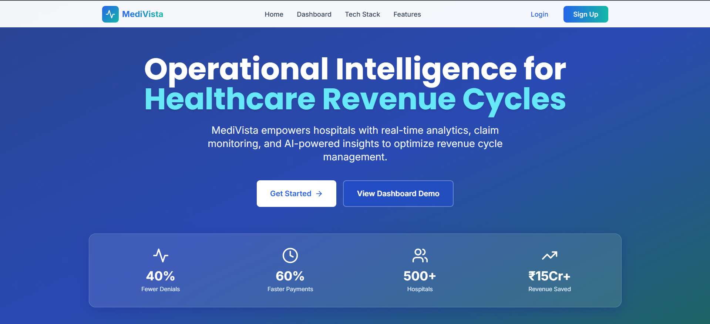
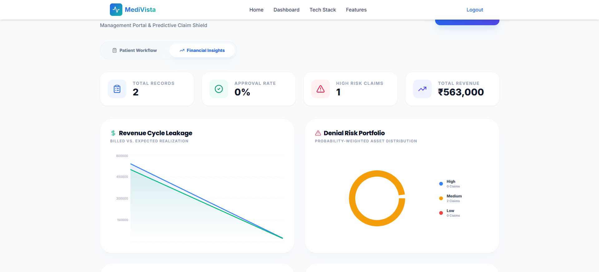
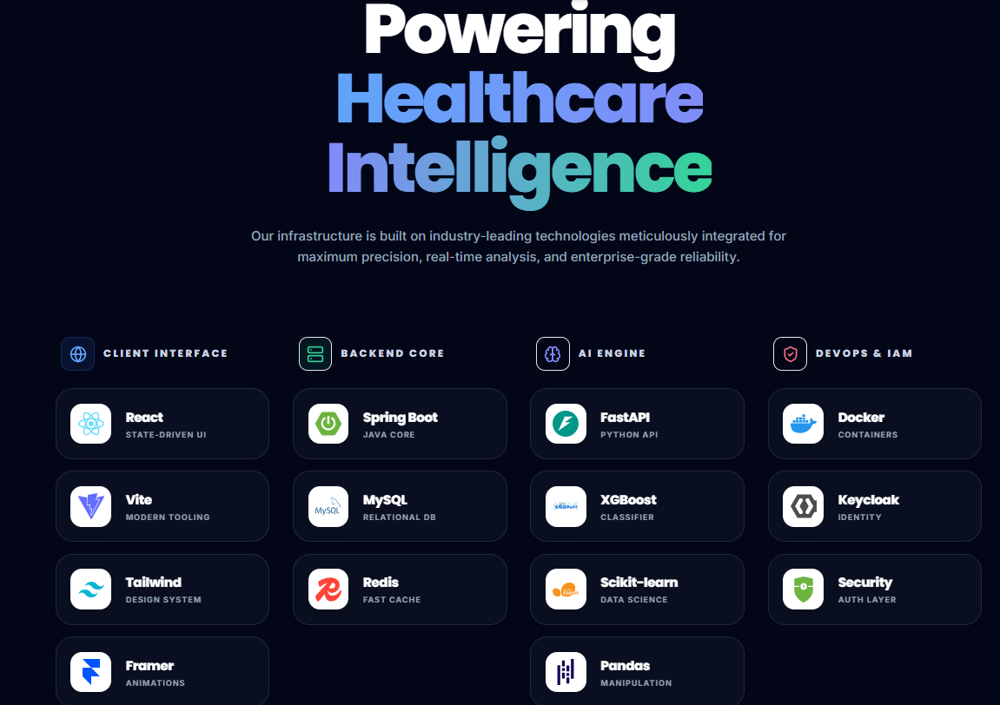

  
  <h2>Next-Gen Autonomous Revenue Cycle Management (RCM)</h2>
  
  

 

  <strong>An Intelligent, Predictive Revenue Cycle Management system designed to eliminate claim denials and automate hospital billing operations using Machine Learning.</strong>

  <i>Built with ❤️ by <b>Buggi Coders</b></i>

---

## 🌟 The Vision

In the modern healthcare system, claim denials cost hospitals millions of dollars and countless administrative hours. **MediVista** revolutionizes the RCM (Revenue Cycle Management) pipeline. By intelligently analyzing patient records, EMR data, and billing systems *before* claims are submitted, MediVista predicts denial risks, categorizes portfolios, and suggests the **Next Best Action** to ensure maximum revenue realization.

## 🚀 Epic Features

- **🧠 Predictive Denial AI**: A custom Machine Learning engine that predicts if a claim will be approved or denied, providing a confidence score and identifying exact bottlenecks *before* submission.
- **📊 Premium Financial Insights**: A breathtaking, dynamic dashboard offering real-time AI-driven analytics on:
  - 📉 **Revenue Cycle Leakage**
  - 🍩 **Denial Risk Portfolios**
  - 🏢 **Departmental Profitability**
  - ⚡ **Payout Velocity Forecasts**
- **💬 Intelligent AI Chat Assistant (Upcoming Update!)**: Talk to your data! A deeply integrated conversational AI that allows hospital administrators to query financial health, retrieve specific claim statuses, and get actionable insights instantly.
- **⚡ Frictionless Smart Intake**: A beautifully animated, step-by-step digital handshake between clinical data and insurance carriers.
- **🔄 Enterprise Integration Ready**: Conceptually wired to interface seamlessly with major EMR systems (Epic, Practo) and Billing logic software.

---

## 📸 Sneak Peek (Screenshots)

  
  
    
  

---

## 🛠️ The Tech Stack (Under the Hood)

MediVista is built as a highly scalable microservices-inspired architecture, designed for enterprise healthcare demands.

### 🌐 Frontend (The Experience)

  
  
  
  

- **Framework:** React 18 + TypeScript + Vite
- **Styling:** Tailwind CSS + Framer Motion (for buttery smooth, premium animations)
- **Charting:** Recharts (Bespoke glassmorphic data visualization)
- **State & Forms:** React Hook Form for robust validation, Context API.

### ⚙️ Backend (The Engine)

  
  
  

- **Framework:** Spring Boot 3 (Java)
- **Database:** MySQL
- **Architecture:** Strict adherence to layered architecture (Controller-Service-Repository), featuring automated DTO mapping, secure RESTful endpoints, and intelligent error handling.

### 🧠 Machine Learning (The Brain)

  
  
  

- **Framework:** Python + FastAPI
- **Core Logic:** Predictive ML serving layers returning Confidence Scores, Risk Analysis, and Expected Payout Timelines. Includes simulated dynamic jitter to generate highly realistic forecasting timelines on the fly.

---

## 👥 The Team: Buggi Coders

We are **Buggi Coders** – a 5-person powerhouse team:

- **👨‍💻 Kaushik Kumar** — *Machine Learning & AI Core*
- **👨‍💻 Prajjwal Saggar** — *Backend Architecture*
- **👨‍💻 Sameer** — *Frontend UI/UX*
- **👨‍💻 Akash Singh** — *Dev OOPs* 
- **👨‍💻 Prakhar** — *CI/CD & Testing Pipeline*

---

## 🌍 Live Deployment
Experience the autonomous RCM platform live:

- <h2>🚀 Live Demo</h2>

## 🎥 Watch Demo

---

## 🎯 How It Works (The Workflow)

1. **Patient Registration:** Administrative staff enters patient demographics via the Smart Intake Form.
2. **AI Pre-Auth:** The data is instantly streamed to the Python ML Server, assessing risk based on the specific carrier, department, and policy type.
3. **Data Sync:** The analyzed claim—complete with AI-backed Action Plans—is securely stored via the Spring Boot Java backend.
4. **Insights Dashboard:** The claim appears in the live workflow, and the overarching financial metrics update dynamically for executives to track.

---

## 🔮 Future Roadmap
- 🔌 **Live AI Agent Chat** for autonomous, natural-language data querying and reporting.
- 🔗 **Real-time Webhooks** for live Insurance Carrier API integration.
- 🛡️ **Automated Anomaly Detection** for procedural billing discrepancies.

---

  <i>Shipping Code. Eliminating Denials. Winning Hackathons. 🚀</i>

